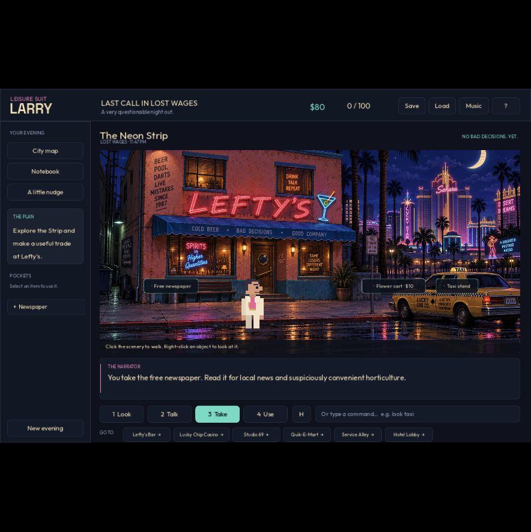

# Leisure Suit Larry: Last Call in Lost Wages

A complete, compact **Godot 4.7.2** point-and-click comedy adventure: thirteen illustrated rooms, alternate puzzle routes, a staged cabaret, optional flings, and an Eve-or-Adam finale. An unofficial modern reimagining of *Softporn Adventure* and *Leisure Suit Larry 1*, with newly created art, dialogue, pixel characters and lounge music.



*Original-release screenshot. See the [upgrade validation report](docs/audits/gameplay-upgrade-validation.md) for the revised interface and current gameplay evidence.*

## Play

- **Native Mac:** open `exports/macos/Last Call in Lost Wages.app`, or double-click `Play.command` to play from source.
- **Browser:** while the preview server runs, visit **http://127.0.0.1:8766**. Start it again with `node tools/serve-web.mjs`. Browser saves belong to that browser/site; native saves are separate.
- **Editor:** open `project.godot` in Godot, or run `./tools/godot --editor --path .`.
- **Portable builds:** `exports/Last Call in Lost Wages-macOS.zip` and `exports/Last Call in Lost Wages-Web.zip`. The Mac build is locally ad-hoc signed, not notarized. Serve the extracted Web files over HTTP; opening index.html directly is unsupported.

The game runs locally and needs no account, API key, Jev, or network after loading. TypeSafe is used only by the separate development playtest lab. All game currency is imaginary.

## Choose your evening

Start a new evening as **Leisure Suit Larry** or **Leisure Suit Lisa** (short for Melisa). Choose heterosexual, homosexual, or bisexual; **bisexual is selected by default**. Heterosexual characters pursue the opposite gender, homosexual characters the same gender, and bisexual characters meet partners of both genders. The final dream date is **Eve or Adam**, with the opposite-gender finale for bisexual players.

Your goal is explicit: **get laid with your dream date before sunrise**. Three optional encounter puzzles offer willing detours around the city. Each has a clue, a recoverable wrong answer, a flirtation, and an invitation you can accept or decline. These encounters do not complete the main story or change the 100-point exploration score. Campy curtain cutscenes keep the intimate action offscreen and state the outcome clearly. The winning invitation gets a dedicated 12-second rooftop-to-sunrise finale starring both characters, with a three-second still version for reduced motion. Completed evenings offer **Replay finale** in the room and ending screen without changing progress or saves. All partners are adults.

Profile and encounter history travel with your save. Older saves retain their progress and points and default to bisexual Larry; an old completed evening reopens the new rooftop invitation so you can play its revised finale.

## Controls

Click a scene target after choosing **Look, Talk, Take, or Use**. Select an inventory item, then click a target to use it. Selecting or right-clicking a pocket item also examines it; double-clicking uses it on itself. Click the scenery to move your character. **Take** collects loose objects; **Use** operates machines and activities. Talking to people opens labeled conversation topics. To buy whiskey, talk to Lefty and choose the explicit **Buy a whiskey miniature · $10** offer, or type `buy whiskey`. **Use** on Lefty opens the same offer. The action line shows your selected item; **×** or Escape cancels it. New items receive a pocket-arrival cue; **Tidy** tucks away used souvenirs without deleting them.

| Input | Action |
|---|---|
| 1 / 2 / 3 / 4 | Look / Talk / Take / Use |
| Right-click target | Examine |
| M / J / H | City map / notebook / hotspot labels |
| O / T | Options / conversation transcript |
| Tab / Enter | Focus the next control / activate the focused button |
| F5 / F9 | Manual save / load |
| F11 | Toggle full screen |
| Enter or command field | Type a parser command |
| Escape | Skip a cinematic, close overlay or clear selection |
| Space / Enter during a cinematic | Skip to arrival or encounter aftermath |

Moving through exits, scenery doors, the map, or parser commands plays a short animated travel vignette: doorway entrances, walks, taxi rides, hotel elevators, rope crossings, or terrace arrivals. Use **Skip travel**, Space, Enter, or Escape to arrive immediately. Reduced motion shows a one-second departure/arrival card. The accepted destination autosaves before the scene; skipping costs no extra moves or money.

Use the map to follow connected routes automatically. Locked rooms open through puzzles. **Need a nudge?** starts with a clue reminder, then offers a narrower suggestion, then an explicitly requested exact solution. The notebook records discovered item locations, character requests, and completed favors. Use slots or blackjack at the casino to open the optional games; `play slots` and `play blackjack` work there too. Unfinished blackjack bets are refunded when closing the table.

On the Web build, **Text & keyboard controls** opens a readable HTML drawer with the current narration, goal, transcript, and the same visible controls. It supports standard keyboard buttons and larger browser text; screen-reader compatibility has not been certified. **Options** includes reduced motion and separate music/effects levels.

Manual Save and Load use one slot. Progress also autosaves after actions. When an autosave exists, the next launch offers **Continue evening**; **? → Restore autosave** restores the same separate slot. New evening does not overwrite the manual save. Scroll within Help to read its complete instructions. Native data is in Godot's user-data folder for this project (`~/Library/Application Support/Godot/app_userdata/Leisure Suit Larry — Last Call in Lost Wages/` on this Mac).

## Included

- 13 illustrated rooms, with six clean background variants for state-driven props and the visibly opened service window. Collected stool, pitcher, core, candy, and voucher disappear; the growing tree keeps its trunk after the apple is picked.
- Three binary route choices: backstage by password/TV or Lefty's bowling promotion; Didi's elaborate prop routine or a volunteer rehearsal; hotel access by espresso favor or a stage-manager introduction. These form eight principal route combinations.
- A player-paced Didi performance with callbacks to your actual choices, a curtain-call skip, and three comic dance styles: confident, careful, or copying Didi.
- Authored Eve/Adam conversations and a clear winning encounter. Friendship and postponing for an after-party keep the night open. A short epilogue remembers the evening's choices.
- Three optional flings: a backstage costumier, casino magician, and garden photographer, with names and presentation matched to your profile. Lisa and Adam have distinct pixel artwork; new signs and private-scene curtains add camp to the existing illustrations.
- 18 inventory items, optional discoveries, a 100-point exploration score, and a complete evening that does not require every optional point.
- Point-and-click and parser input, labeled dialogue choices, contextual objectives, three hint levels, discovered notebook leads, a conversation transcript, and manual/autosaves.
- Responsive desktop and narrower-window layouts, visible keyboard focus, a readable production-Web HTML companion, reduced motion, and separate music/effects controls.
- Animated slots and blackjack, with a casino recovery mechanic that prevents money from blocking the adventure. Gambling remains optional.
- Original lounge music, short offline sound cues, independent pixel actors, and visible character reactions.
- Animated travel and entrance scenes with route-specific movement, rotating adult comedy captions, a skip control and reduced-motion stills. See [travel scene validation](docs/audits/travel-cutscenes.md).
- **46 historical reference images**: 44 screenshots and two manual scans, with provenance. Open [the searchable reference gallery](reference/index.html).
- Godot, macOS/Web export templates, local Godot MCP configuration, and installed GDScript and TypeSafe skills.

The adaptation keeps the bar/remote/password, disco gifts, phone/rope, hotel favor and grown-apple chain. It changes motivations and condenses the route. It is **not a scene-for-scene reproduction** of either original: original commercial art/dialogue/music, several bedroom/chapel branches, death timer, taxi simulation, voice acting and full NPC animation are not included. Romance remains suggestive and non-explicit. [Design and scope](docs/design.md) explains the choices.

## Playtest and verification

Character hotspot labels now sit above or beside their characters and reflow around other labels and scene edges. See the [before/after screenshots and placement checks](docs/audits/hotspot-labels.md).

The [four-act finale update](docs/audits/finale-cutscene.md) adds the extended ending and saved-evening replay, with pairing, accessibility, lifecycle, and live browser checks.

The [Larry/Lisa camp update](docs/audits/camp-update.md) covers all six profile configurations, optional encounters, the revised winning goal, save migration, final code checks, live Jev runs, and an assistant-operated full Lisa browser playthrough. [Historical visual references](docs/camp-reference.md) explain the new parody staging.

The earlier [animated-travel update](docs/audits/travel-cutscenes.md) passed 4,245 Godot assertions and 34 Node tests. Live Browser checks covered entrances, walking, taxis, elevators, rope travel, skipping, reduced motion and interrupted-travel restoration. Two additional Jev runs completed with 48 real animated transitions; the report distinguishes their build from the final visual correction.

The upgrade includes deterministic route, ending, save, interface, visual-state, companion, and QA-isolation checks. The [previous upgrade validation report](docs/audits/gameplay-upgrade-validation.md) records the final tested build, live Jev batches, actual browser playthroughs, defects, and remaining limits. That version passed 3,893 Godot assertions and 34 Node tests. Jev completed 86/100 evenings in the main campaign and 8/12 on the final corrected build; failures remain documented. Human enjoyment and the full performance gates remain open.

The earlier build was played from beginning to end twice through the actual browser UI without hints, finishing at 100/100 in 97 and 85 moves. Those are **historical baseline results**, not results for this upgraded build. The tester knew the implementation; they were informed playtests, not blind newcomer sessions. See the [original browser audit](docs/audits/browser-playthrough.md) and [verification history](docs/verification.md).

Fresh-player enjoyment studies, screen-reader certification, and the plan's performance targets remain separate validation work. No model score or automated test establishes that the game is fun or award-worthy.

## Jev development playtesting

TypeSafe is installed for Codex at `.agents/skills/typesafe-ai/`; `AGENTS.md` records the project workflow. A separate local lab supports 2, 4, or 8 isolated Godot Web workers and bounded batches of up to 100 fresh runs, with Jev choosing actions from player-visible text. Capacity is not a claim that those runs have finished; actual sample sizes and outcomes belong in the validation report. The lab records confidence, candidate sets, observed outcomes, build hashes, timing, failures, and deterministic loop stops. The API key stays in the ignored `.env` and the server; the normal game still needs no network or account.

- [Run the playtest lab](tools/jev-qa/README.md)
- [Measured experiments and limitations](docs/jev-experiments.md)
- [Prioritized gameplay upgrade plan](docs/gameplay-upgrade-plan.md)
- [Applicable TypeSafe cookbooks](docs/typesafe-research.md)

Generated exports and installed dependencies are excluded from Git; the source, art, music, tests, research and experiment evidence are included. Rebuild with `./tools/package.sh all`.

## Research and development

- [Cited research and version differences](docs/research.md)
- [Source/image manifest](docs/references.json)
- [Complete walkthrough — spoilers](docs/walkthrough.md)
- [Godot, MCP and skill setup](docs/tooling.md)
- [Art prompts, asset origins and credits](docs/art.md)
- [Upgrade prop art and exact edit prompts](docs/art-upgrade.md)
- [Original music and reproduction](docs/audio.md)
- [Verification results](docs/verification.md)

```sh
./tools/godot --headless --path . --script tests/test_game.gd
./tools/godot --headless --path . --script tests/test_casino.gd
./tools/godot --headless --path . --script tests/test_interface.gd
./tools/godot --headless --path . --script tests/test_narrative.gd
./tools/godot --headless --path . --script tests/test_modal_layout.gd
./tools/godot --headless --path . --script tests/test_action_intent.gd
./tools/godot --headless --path . --script tests/test_upgrade_routes.gd
./tools/godot --headless --path . --script tests/test_upgrade_interface.gd
./tools/godot --headless --path . --script tests/test_upgrade_visuals.gd
./tools/godot --headless --path . --script tests/test_web_companion.gd
./tools/godot --headless --path . --script tests/test_window_responsive.gd
./tools/godot --headless --path . --script tests/test_travel_cutscenes.gd
./tools/godot --headless --path . --script tests/test_identity_romance.gd
./tools/godot --headless --path . --script tests/test_profile_interface.gd
./tools/godot --headless --path . --script tests/test_encounter_visuals.gd
./tools/godot --headless --path . --script tests/test_qa_bridge.gd
./tools/godot --headless --path . --script tests/test_memory_lifecycle.gd
node --test tests/test_jev_client.mjs
./tools/godot --headless --path . -- --smoke-ui
node tools/mcp-smoke.mjs
./tools/package.sh all
```

`game_state.gd` owns the independent model; `main.gd` renders it; `actor.gd` draws the actors; `world_effects.gd` selects state-aware backgrounds and draws puzzle props; `travel_cutscene.gd` presents route-aware travel vignettes; `encounter_cutscene.gd` stages private invitations and comic aftermath; `sound_effects.gd` supplies offline cues; `web_companion.gd` mirrors visible controls into readable HTML; `casino_panel.gd` owns the casino tables. `docs/`, `reference/`, development tools and tests are excluded from released game packs. No historical game binaries or original game assets are shipped in the builds.

The supplied walkthrough is retained untouched at the project root. This is an unofficial fan project; the original game names and characters belong to their respective owners.
