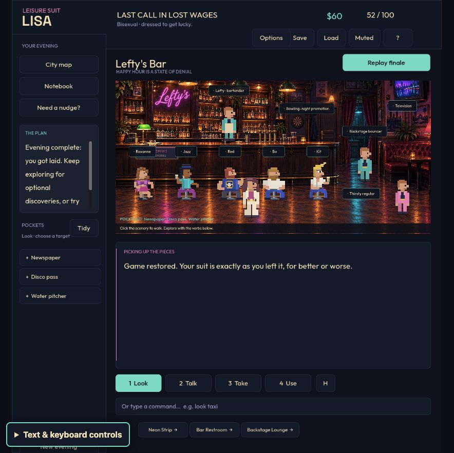
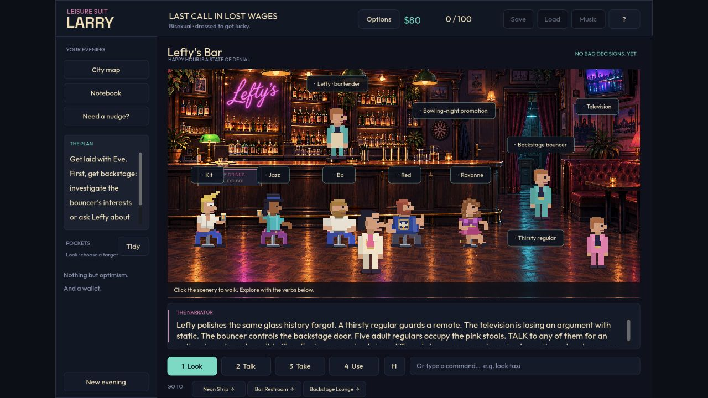

# Five new regulars at Lefty's

September 23, 2026. Five interactive adults reinterpret the supplied bar-stool silhouettes. Each has seated and standing pixel art, hover and interaction gestures, a separate optional puzzle, and a matching partner in the existing campy curtain scene. Larry also has the larger-nosed side profile from the reference. [Art decisions, asset and exact generation prompt](../art/bar-regulars.md).

| Patron | Optional story | What changes between evenings |
|---|---|---|
| Kit / Kitty | Restore a jukebox dedication: style, then tempo | Three music combinations |
| Roxanne / Rex | Recover a Salon alias and discreet napkin signal from the hotel guestbook | Three alias/signal pairs |
| Bo / Bonnie | Read the shop recipe column and mix a zero-proof drink | Three ordered recipes |
| Jazz / Jax | Learn the alley busker's cue and perform a three-beat audition | Three rhythms |
| Red / Reddie | Deduce the open road and creature badge from the street rally notice | Three road/badge combinations |

A new evening shuffles the five seats and chooses the five puzzle variants once. Revisits, autosaves and manual loads retain those choices and unfinished steps. Larry/Lisa and all three orientations have compatible cast presentations. Bisexual evenings include both genders. No model service is needed to play.

Helping is separate from flirting; an invitation can be accepted or declined. Roxanne/Rex is an independent escort with a visible fictional $20 appointment fee, charged once on acceptance. A wrong answer costs nothing and resets only that patron's answer sequence. All five stories remain optional and add no exploration points. They preserve the Eve/Adam finale, including an already-completed ending; subsequent encounters acknowledge the after-party. Intimate action stays offscreen.

## Automated checks

[Final code report](bar-code-checks.json): **11,571 Godot assertions across 17 suites and 34 Node tests passed**. Recorded game-script hashes were unchanged during those checks.

- The new model suite completed **150 bar routes**: six player profiles × five seeds × five patrons. Those seeds cover all three variants for every patron and profile. It checks clue gates, wrong answers, declining, exact/insufficient funds, single charging, stale choices, location restrictions, save round trips, malformed-save rejection, and v1/v2 migration.
- The new interface suite checks all five bodies and labels across all six profiles using real viewport input, plus matching dialogue portraits, parser `USE`, puzzle/accept callbacks, cutscene actors, skips and completed-ending preservation.
- Existing main-route, animation, label, layout, reduced-motion, bridge isolation, save, travel, encounter and profile suites pass. The full interface route still reaches 100/100 and the ending.
- [Native lifecycle sample](bar-memory-lifecycle.json): ten cycles after two warmups, static-memory baseline 38,172,337 bytes and final 38,916,633 bytes (1.0195 ratio). This bounded sample is not a long-session memory guarantee.

Initial testing exposed strict JSON round-trip failures caused by integer fields returning as floats. Restore now normalizes validated numeric fields without weakening the assertions. Review and browser testing also caught parser `USE` not opening choices, truncated label padding, ambiguous wrong-answer wording, and aftermath text ignoring a completed finale. Those were fixed before the final code run.

## Agent-operated browser walkthrough

The normal Web game on port 8766 was played through visible text/keyboard controls, with screenshots of the canvas. This was an informed agent walkthrough, not a blind human playtest.

The existing completed Lisa/bisexual evening migrated without resetting its ending. All five new paths were completed through ordinary travel, observation and dialogue:

1. Kit: Blues → Slow. A wrong answer and a declined invitation were tested before accepting. The matching two-character scene played through.
2. Roxanne: read the hotel guestbook, choose M. Satin, **reload the browser midway**, continue the autosave and choose Blue. The invitation charged $20 once. Talking afterward offered an in-joke, with no repeat fee.
3. Bo: read the magazine recipe; Ginger → Cherry → Soda. The accepted encounter could be skipped.
4. Jazz: read the busker's rhythm; Hold → Rest → Tap. The encounter retained the hat, turquoise clothing and skin tone.
5. Red: read the street rally notice; Mountain → Snake. The encounter retained the blue vest and matching character.

Cash moved from $80 to $60; score stayed 52; the completed Adam ending and Replay finale remained available. All five encounters appeared in the notebook. [Visible route notes](bar-evidence/browser-route.txt) and [capture directory](bar-evidence/) preserve the observations.

Final dialogue polish followed this walkthrough; the complete automated suite was rerun afterward. The final normal build was reloaded and visually checked. A separate fresh QA Larry evening verified the clearer Start button, travel into the bar, side profile and direct character-body Talk input opening Red's matching portrait. That QA instance had no access to manual/autosaves.

## Jev browser experiments

The existing TypeSafe integration was used without changes. The current [function-calling cookbook](https://docs.typesafe.ai/cookbooks/function_calling) supports the approach already used here: a bounded semantic choice from explicit candidates, followed by deterministic application execution. Exact inputs, candidate sets, confidence, model version and observed outcomes are retained in the compressed traces linked below. No source-derived solutions or hidden quest flags were supplied as player observations.

Each batch used two live Web QA instances on port 8767, two runs, a 100-action limit per run, a 200-request batch cap, a 5,000,000 observed-input-token threshold and a $0.25 estimated-input-cost threshold. Memory was enabled; configured seed was 20260923. The returned model was `jev-1.13.0`. Cost estimates are not bills and exclude unknown usage; timing is machine- and workload-specific.

| Batch | Outcomes | Requests / input tokens | API latency p50 / p95 | Estimated input cost |
|---|---|---|---|---|
| [Initial](../experiments/jev/2026-09-23T17-01-49-154Z/aggregate.json) | Both players abstained at setup after two actions; 0/2 completed | 6 / 13,630 | 218 / 303 ms | $0.00057246 |
| [Follow-up](../experiments/jev/2026-09-23T17-03-22-883Z/aggregate.json) | Goal player completed in 91 actions; curious player stopped in a rooftop dialogue loop after 73; 1/2 completed, 1/2 loop stops | 164 / 1,135,583 | 251 / 347 ms | $0.047694486 |

The initial failure prompted renaming the setup action from “Get lucky as Larry/Lisa” to “Start evening as Larry/Lisa.” Both follow-up players entered the game. This small sample does not establish causation. The rooftop loop remains a recorded limitation of the curious model run; the other player and the deterministic route completed.

**Neither Jev player chose a new bar patron.** These experiments exercise the existing main route with the expanded bar present; they do not provide model-player coverage of the new puzzles. New-puzzle evidence comes from the 150 deterministic routes, interface checks and five-path browser walkthrough above. Text-driven decisions do not test visual perception or prove enjoyment.

There were no API errors. In the follow-up's visible browser sampling, 11,924 of 11,981 requestAnimationFrame intervals were at most 20 ms after a two-second warmup (99.52%). These are browser callback intervals, not GPU render times. Per-action traces retain confidence; median choice confidence was 0.64 for the goal player and 0.54 for the curious player. Confidence is not a correctness or quality score.

## Builds and packaging

Web and macOS exports were rebuilt, their packs inspected, and the ad-hoc signed macOS app passed a 30-frame headless launch check. [Build hashes and verification](bar-build-checks.json) identify the final outputs. This launch smoke check does not substitute for the browser walkthrough.

Final packaging review caught a pre-existing untracked local screenshot and the skills lock file being included by Godot's all-resources filter. All three export presets now exclude them. The package check first rejected the old packs, then passed rebuilt ones, including checks against imported screenshot textures. The user's local screenshot files were left untouched and are not committed. Existing credential and development-file exclusions remain in force.

The Jev batches predate the last dialogue polish and packaging-only exclusions; each trace records its actual build hash. Browser captures and code checks have their scopes described above, rather than treating all evidence as a test of one identical binary.
