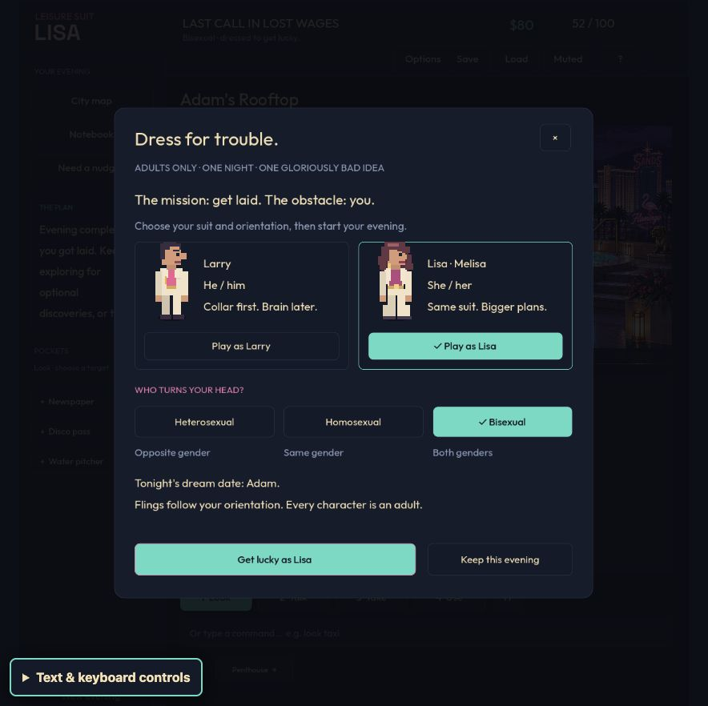

# Larry, Lisa, and a night worth ruining your hair for

The game's ambition is now explicit: **get laid with Eve or Adam**. The new opening, journal, ongoing objective, conversations, private-room scenes, and ending all reinforce that goal. Optional flings are willing detours, not substitutes for the final pursuit. This is an original camp adaptation with suggestive staging and offscreen intimacy, not a reproduction of the originals' artwork or dialogue.

## Identity, attraction, and continuity

New evenings offer Larry or Lisa (short for Melisa), with bisexual selected by default. Profile selection previews the final partner before starting. The same puzzles, costs, opportunities, and rewards apply across all six profiles.

| Character | Orientation | Optional partners | Final pursuit |
| --- | --- | --- | --- |
| Larry | Heterosexual | Women | Eve |
| Larry | Homosexual | Men | Adam |
| Larry | Bisexual (default) | Women and men | Eve |
| Lisa | Heterosexual | Men | Adam |
| Lisa | Homosexual | Women | Eve |
| Lisa | Bisexual (default) | Women and men | Adam |

The chosen identity follows the actor, travel scenes, dialogue, notebook, room names, saved game, and ending. Saves use version 2. Version-1 evenings retain their progress and points, default to bisexual Larry, and reopen the revised final invitation if the older ending was already completed. The ending award cannot be collected twice. Invalid profile data and inconsistent completion data are rejected without partially replacing a live game.

The three incidental encounters are authored characters in existing locations, not random events: a backstage dresser, casino magician, and garden photographer. Each has an inspectable clue, a recoverable wrong answer, a puzzle, flirtation, and an explicit accept/decline invitation. Declining allows a later invitation. Accepting records the encounter once, grants no points or money, and leaves the rooftop goal unfinished. Bisexual players meet both genders; other orientations receive compatible casts.

Eve or Adam still requires the apple and mutual conversation. Friendship and the after-party remain choices that leave the final pursuit open. Accepting the private invitation produces the final scene and **YOU GOT LAID** ending. Every romance character is an adult.

## Visual and comic treatment

The existing illustrated rooms remain the foundation. New native-drawn Lisa, Adam, and optional partner sprites keep the readable low-resolution silhouette style. Six environmental signs add original camp innuendo. Travel uses the chosen character and correct host name. Private-room vignettes show fully clothed partners approaching, theatrical curtains, a Do Not Disturb sign, and a plainly stated comic aftermath. The normal scene lasts 5.4 seconds, reduced motion 1.8 seconds; Space, Enter, Escape, or the visible Skip button can finish it. State is committed once before animation, so interruption cannot duplicate rewards or lose an accepted encounter.

[Reference research](../camp-reference.md) distinguishes images actually inspected from historical interpretation, covering Larry 1 (1987), Larry 2, and the 1991 VGA remake. No archival artwork was added to the shipped game.

## Actual browser playthrough

The assistant operated the ordinary Web build at `http://127.0.0.1:8766/`, using the visible canvas and its text/keyboard controls. This was an informed implementation-aware playthrough, not a blind human newcomer study.

- Restored an older completed save and confirmed its progress survived while the new final invitation reopened.
- Started **Lisa/bisexual**, with Adam correctly named as the final pursuit.
- Met Ruby at the casino, made a wrong puzzle choice, recovered from its feedback, declined the invitation, then reopened and accepted it. Watched the scene; the main objective and wallet remained unchanged.
- Earned backstage access through Lefty's bowling promotion. Solved Vince's dressing-screen puzzle, accepted his invitation, and skipped with Space through the real visible control. Reloaded and continued: Lisa, encounter history, and the one-time aftermath were retained.
- Completed the Studio 69 volunteer performance and stage-manager introduction. Lisa's name appeared correctly in the performance. Reached the hotel and garden without granting inventory or flags.
- Solved Florian's lantern puzzle and accepted the third optional encounter. No optional encounter prematurely ended the story.
- Met Adam on the rooftop. Acquired the pitcher and apple materials through ordinary actions. A premature planting attempt gave the newspaper clue and preserved the items; reading the paper allowed recovery.
- Gave Adam the apple, shared the story, listened, and chose friendship first. The evening remained open. Returned to the private invitation and watched the Adam/Lisa finale: **52/100, 76 moves, $80**, with all three optional encounters recorded.
- Inspected homosexual setup previews: Lisa led to Eve, Larry to Adam. Canceling a draft from an active evening preserved that evening.

The browser pass found compact-screen clipping in setup and a downward-travel caption on an upward terrace journey. Both were corrected. A final setup inspection at 884×886 confirmed readable instructions, identity cards, orientation choices, partner preview, and dark text on mint buttons. The final upward-travel caption was checked separately. The original playthrough predates these small presentation fixes; screenshots and later checks preserve that distinction.

Additional captured evidence: [Ruby encounter](camp-browser-evidence/02-lisa-ruby-encounter.png), [Adam's rooftop](camp-browser-evidence/03-lisa-adam-rooftop.png), [final scene](camp-browser-evidence/04-lisa-adam-finale.png), [completed evening](camp-browser-evidence/05-lisa-complete.png). Earlier setup screenshots deliberately preserve the pre-fix layout.

## Model players and fixes informed by them

The [Jev analysis](camp-jev-analysis.md) records exact batches, build hashes, model versions, inputs, candidate sets, confidence, outcomes, timing, usage, and failed runs. These are live Web instances controlled through actual UI callbacks using player-visible text. They do not test visual perception or prove enjoyment.

The initial four-player batch completed 3/4 evenings. All four independently chose heterosexual Larry. The fourth accepted Velvet's optional encounter, then stalled while two valid hotel routes remained available. Its trace exposed two stale prerequisite replies: a rope still requested an already-completed phone call, and the TV requested a password despite earned social backstage access. Both replies were fixed, with twelve assertions across the six profiles.

A separate two-player post-fix check stopped during setup: both returned valid low-confidence abstentions despite an available Start button. Those failures remain recorded. A short explicit choose-then-start instruction was restored for clarity; the evidence does not establish what caused the abstentions. The final two-player check completed **2/2** evenings: Larry/bisexual in 84 actions and Larry/heterosexual in 120. It used the clarified setup and preceded only the later existing-save startup fix. Its exact build boundary is in the linked analysis; no unsuccessful run was replaced or omitted.

## Verification and limits

**5,631 Godot assertions across 17 suites and 34 Node tests passed.** [Code-check evidence](camp-code-checks.json) records every suite and final source hashes. Coverage includes six profiles, compatibility, wrong-answer recovery, declines and reopenings, completion semantics, legacy saves, actual UI setup callbacks, scene skipping, reduced motion, duplicate/stale actions, and QA isolation. The normal game remains offline and cannot activate the development bridge. The credential stays in the local ignored `.env`, never in browser observations or exports.

[Build evidence](camp-builds.json) identifies the normal Web and macOS exports, QA pack, package-content checks, and signed native launch smoke check. macOS is locally ad-hoc signed, not notarized. The native smoke check is not a full native playthrough.

A final review found a startup-only cancellation risk: choosing a fresh evening from the resume prompt, then canceling its profile draft, could expose the temporary empty game instead of the stored evening. The fix returns to the resume prompt, preserving the autosave. This path has its own UI regression and final browser check: changing a draft to Lisa/homosexual and canceling returned to Continue; Escape kept the resume prompt open; Continue restored the completed Lisa/bisexual evening with 52 points and $80. [Final restored-save screenshot](camp-browser-evidence/08-final-save-restored.png). It does not affect the fresh isolated Jev workers, but the later export is separately identified rather than credited with playing an earlier binary.

Remaining limits: no blind human enjoyment study, no screen-reader certification, and no controlled GPU/performance benchmark. Text-model completion, high confidence, and passing deterministic checks are evidence about specific behavior, not proof that the game is addictive or award-winning.
