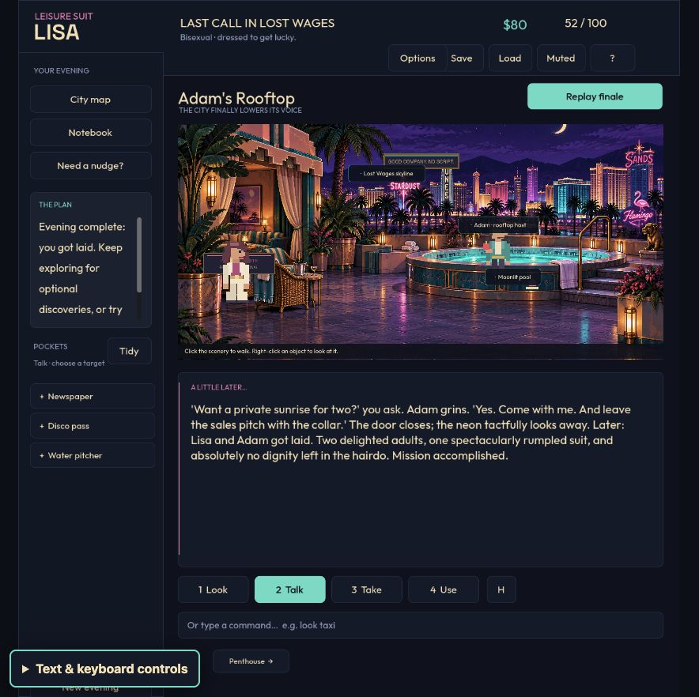
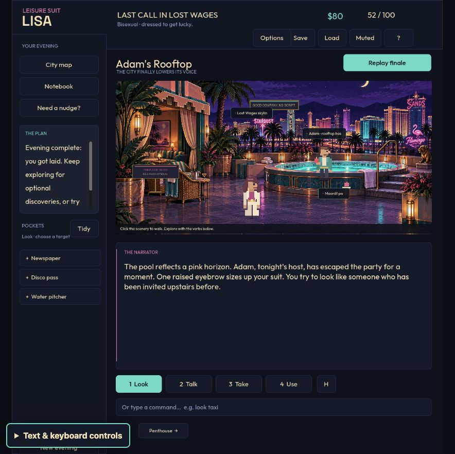

# Hotspot label placement — September 23, 2026

Adam's label covered his face in the live Web game. Character labels now prefer a position above the sprite's full silhouette, try either side when space is tight, and stay inside the scene. All labels, including object labels and compact `+` targets, avoid the other characters and already placed labels. Names reserve their space first. Positions update when an actor moves or changes scale, or a button changes size; no continuous layout polling is needed.

The old layout used a fixed offset from the interaction anchor, which did not describe the drawn head. Its overlap loop only considered other labels. The replacement uses the actor's transformed drawing bounds, measures actual text widths, and evaluates visible candidate rectangles. If a future scene has no unobstructed candidate, it chooses the least obstructive visible placement, prioritizing character art. The moving player has no character hotspot and is not a label obstacle.

## Before and after

These are screenshots from the actual normal Web export in the Codex in-app browser at `http://127.0.0.1:8766/` (884 × 886 viewport), taken by the assistant while operating the game. They are not mockups or headless test renders.

| Before: Adam's face covered | After: face clear |
| --- | --- |
|  |  |

Also checked [all three characters in Lefty's Bar](hotspot-label-evidence/after-leftys.png), [the shop clerk beside the espresso hotspot](hotspot-label-evidence/after-shop.png), and [compact shop hotspots](hotspot-label-evidence/after-shop-compact.png). Travel used normal map controls; labels were restored and the game returned to Adam's Rooftop. This was a focused visual and interaction check, not another full playthrough or enjoyment study. A browser wait expired during the travel animation; the next observation confirmed successful arrival.

## Regression and validation

The initial test reproduced the reported defect before implementation: **1 passed, 1 failed**, with `Adam's hotspot does not cover his actual face` failing. Its face rectangle is derived independently from the drawn pixels, rather than the production placement helper. This direct, deterministic reproduction identified the fixed-offset cause without a Git bisect.

The expanded suite initially found a second issue: **332 passed, 1 failed** when Adam changed scale. Godot's local-transform notification now triggers reflow for position and scale changes. The final [label suite](../../tests/test_hotspot_labels.gd) passes **333 checks** covering all 13 rooms, both casts, expanded/compact labels, 1440 × 960 and 884 × 886 real Window sizes, crowded props, characters moved to the top/left/right edges, scale changes, and the relocated Adam button's real callback.

Final targeted validation: **1,717 Godot assertions across eight suites and 34 Node tests passed**. The suites cover label layout, the complete UI route, QA bridge isolation, Web companion controls, responsive windows, visual state, encounter scenes, and travel scenes. See [machine-readable results and source hashes](hotspot-code-checks.json). Source hashes were unchanged during these checks.

Rebuilt normal Web, macOS, and Web QA exports. Export contents, archive packaging, native signing, and a 30-frame native launch smoke check passed; see the [build manifest](hotspot-builds.json). No TypeSafe integration changed or Jev API campaign was run: text-based model choices do not validate whether a label covers rendered pixels.

Reproduce the dedicated check with:

```sh
./tools/godot --headless --path . --script tests/test_hotspot_labels.gd
```
