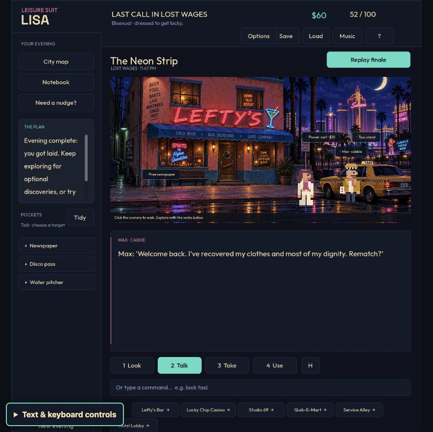
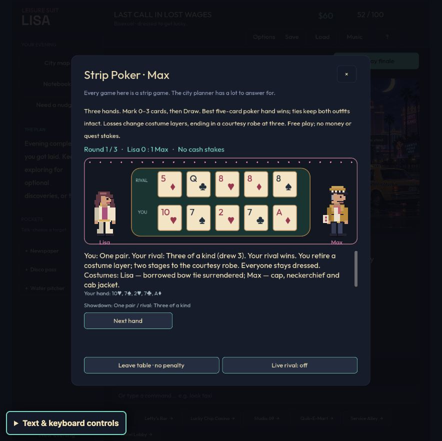
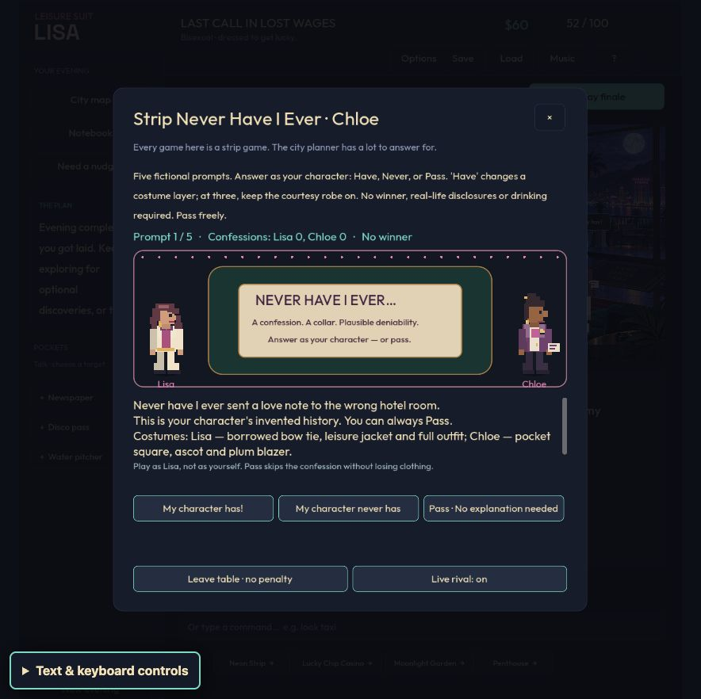
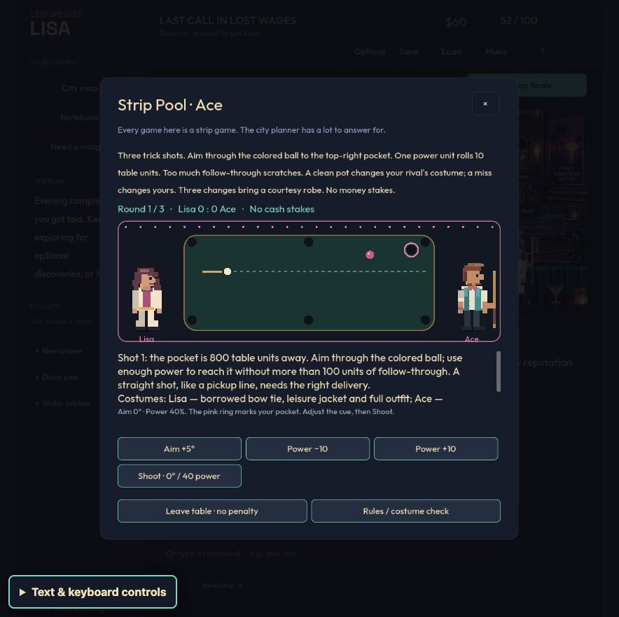
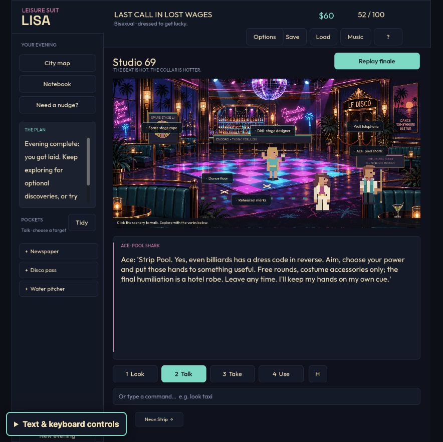

# Every game on the Strip

Three new adults make the taxi stand, hotel lounge and disco social spaces. Each has original pixel artwork, profile-aware casting, hover/action reactions, a playable game, and a separate optional nightcap. The running joke is that this city cannot offer an innocent game without involving somebody's wardrobe.

| Host | Where | Play |
|---|---|---|
| Max / Moxie, off-duty cabbie | Neon Strip, beside the parked taxi | Three hands of Strip Poker: choose up to three discards, draw, and compare five-card hands |
| Chaz / Chloe, lounge host | Come-On Inn lobby | Five rounds of Strip Never Have I Ever from 24 authored scenarios: Have, Never, or Pass |
| Ace / Dee, billiards regular | Studio 69 | Three Strip Pool skill shots: align the cue with the ball/pocket and choose power from the displayed distance |

Talk or use an empty hand on a host to join. The parser also supports `play poker`, `play never`, `play never have i ever`, and `play pool` in the appropriate room. There are no cash stakes, quest gates or score rewards. A completed game unlocks a flirtation regardless of who won; the subsequent invitation can be accepted or declined. The main Eve/Adam goal stays intact. New games reshuffle the deck or scenario; completed-session flags survive saves, while unfinished matches are deliberately transient.

The hosts have different costume progressions, ending in a courtesy robe after three changes. Curtain introductions and short wardrobe interludes use both actors, with a skip control and still poses for reduced motion. Nightcap cutscenes keep the same cast and put the intimate action offscreen.

## Rules and optional intelligence

`party_games.gd` owns the deck, all nine poker categories and tie-breaks, confession counters, shot geometry and outcome. `party_panel.gd` owns input, presentation and cancellable requests. `party_table.gd` draws the cards, prompt stage and pool guide. No inference can change a dealt card, invent a legal action, grant progress or decide consent.

The optional local Jev service selects one of four rival draw policies or a reviewed party quip. It receives the rival's own cards and public discard count, or a fictional scenario/answer. It never receives the player's poker hand, deck order, save data or hidden quest state. Pass is local and does not call Jev. Pool is deterministic and uses no API. Static hosted exports and unavailable/disabled services use local decisions.

The server reads the ignored `.env`; keys are absent from browser payloads and exports. The service limits requests, concurrency and input size, validates the exact local origin and host, and applies a 1.5-second provider deadline without retries. Godot rejects mismatched/stale replies, cancels work on close/rematch, and falls back locally. See [the current TypeSafe docs, applicable cookbooks, operating limits and experiment failures](../party-jev-research.md).

## Code and build verification

The final relevant suite passed **26,048 Godot assertions/checks across 20 suites**, plus **56 Node tests**. This includes the earlier adventure, travel, identity, label, animation and isolation checks, as well as:

- 10,377 party-model assertions covering seeded matches, card uniqueness/ranking/ties, invalid actions, confession choices, wardrobe limits, shot success/miss/scratch and legal fallback.
- 3,858 party-interface checks covering all 18 host/profile combinations, complete matches, dialogue/parser/body/label paths, save restoration, reduced motion, panel layout, all party cutscene pairings, absent-host commands and player/host separation.
- 160 mocked client-lifecycle checks covering valid/invalid/error/oversized replies, real timeout fallback, opt-out, old request IDs, revision changes, closing, rematching and saving final completion before optional banter returns. These make no API requests.
- 22 Node party-service tests, in addition to the existing 34 TypeSafe-client tests, including catalog parity, budgets, origin validation and hidden-input rejection.

[Final test details and source hashes](party-code-checks.json) distinguish headless model/UI checks from browser observations. The native lifecycle sample is [10 measured cycles after two warmups](party-memory-lifecycle.json); it is not a long-running leak or performance certification.

macOS and normal Web packages were rebuilt and checked for all five compiled party modules, required resources and exclusions. The signed Mac export passed its 30-frame native launch smoke check. Web QA was rebuilt separately with its existing feature boundary. The [build record](party-builds.json) retains final hashes and scopes; generated binaries remain excluded from Git.

## Actual browser play

The assistant operated the local normal Web game through visible controls and screenshots as bisexual Lisa, continuing an existing completed Adam evening. This was an informed developer playtest, not a blind newcomer or human enjoyment study. [The recorded visible round results](party-evidence/browser-route.json) preserve three full matches:

- **Poker:** Lisa won hand one with three of a kind against high card; Max won hand two with four of a kind and hand three with a flush. Final score 1–2. All three rival policies came from actual Jev calls. The completed-session flirtation persisted across reload; accepting the cabbie's separate invitation played a correctly cast nightcap.
- **Never:** Have, Pass, Never, Have, Have across five different prompts. Pass removed no clothing and caused no API call. Both characters reached their courtesy robes; the session completed without a winner. The other four responses used Jev-selected quips.
- **Pool:** a visually lined-up 10°/80-power clean pot, a deliberate aim/power miss, and a correctly aimed 10°/100-power scratch. Final score 1–2. The result explained the correct line and power interval. Rematching reset scores/clothing; leaving discarded the unfinished match without a penalty.

Cash and adventure score remained **$60 and 52/100** throughout these games. The existing ending and replay control remained available. Additional checks covered a reduced-motion pool round (then restored the setting), reload persistence, and an offline poker showdown with Live rival off. The final export's cabbie and pool-host approach spacing was inspected again after the overlap fix. The final browser console check returned no captured warnings/errors.

The full matches ran on successive development exports while defects were corrected. Exact per-match pack hashes were not captured. The final source received the full regression suite and targeted browser rechecks; a final wording pass replaced repetitive result reminders with poker punchlines. The earlier round snapshots retain the wording actually observed. This report does not present those snapshots as a second complete playthrough of the final binary.

## Jev observations and defects fixed

The two 12-case API fixture batches are documented in [the research report](../party-jev-research.md). An initial batch exposed weak poker choices and the model treating “Never” as a Pass. Readable code-derived poker facts improved authored-heuristic agreement from 4/6 to 5/6; mechanically excluding the Pass-only response eliminated that mismatch in the repeated three cases. One weak legal strategy remained, and response variety was limited. Those are small repeated fixtures, not benchmarks.

During the browser games, **7/7 requests returned Jev decisions**, with zero API fallbacks: three poker policies and four party quips, all using `jev-1.13.0`. Observed API latency was **313–408 ms**, p50 **336 ms**, p95 **408 ms**; usage was **5,202 input / 464 output tokens**. These were sequential local requests under the service limits, not a load test. [The live summary](../experiments/party-jev/browser-live/summary.json) joins inputs, candidate menus, confidence/model version and observed round results; its adjacent raw trace retains model probabilities and request wording. Confidence is not proof of strategy quality or comic timing.

Checks and live play found and corrected overlapping rule text, numeric card-suit rendering, pool guide direction/aspect ratio, incomplete pocket marking, generic nightcap actors, a misplaced cabbie, the player walking over hosts, absent-host parser errors, noisy malformed-response handling, stale reply settlement and pending requests surviving rematches. The last Never completion is recorded before optional banter so closing the table cannot lose it.

Pool is a compact skill-shot game rather than full eight-ball. Jev does not perceive the rendered scene in this integration, and this work does not establish fresh-player enjoyment, broad device compatibility, sustained frame-rate targets or award-worthiness.
