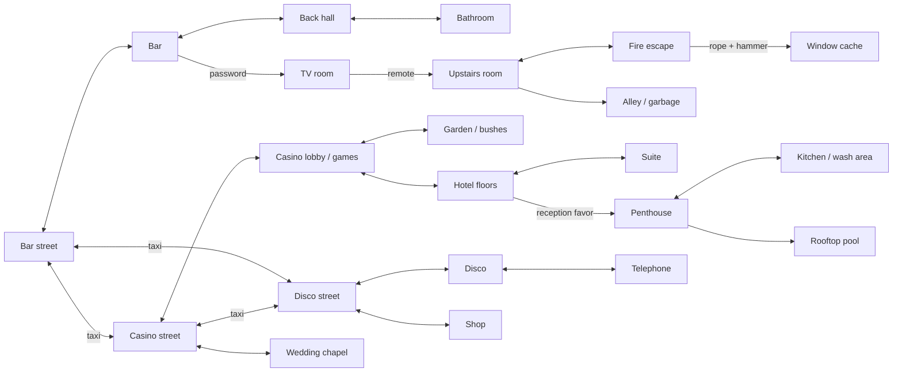

# Softporn Adventure / Leisure Suit Larry research

Research date: 21 September 2026. This is the historical and design reference for the Godot adaptation. The original games are distinct versions; this document separates evidence from adaptation choices. The user-supplied `softporn_adventure_walkthrought_snippet.txt` is the principal puzzle brief. No original game executable or disk image was downloaded.

## Findings that should guide the game

**Preserve the comedy of an overconfident adult on an ill-advised night out, the compact interconnected city, and the delight of noticing and combining unlikely objects.** A modern adaptation should make those interactions understandable, give every room several things to inspect, and deliver an actual ending.

Al Lowe's first-person account says Chuck Benton made the text-only Apple II game as a programming experiment. Lowe says the 1987 graphical game retained the predecessor's locations and puzzles, introduced Larry as the protagonist, and added a narrator who mocks his behavior. He describes writing hundreds of responses to observations and unexpected parser commands. That makes responsive, humorous inspection text a more important fidelity target than reproducing command-entry friction. His retrospective also identifies Mark Crowe as the artist and dates the initial release to June 1987. These are creator recollections, not an independently audited development log. [Al Lowe, “First, Softporn”](https://allowe.com/games/larry/inside-stories/softporn.html)

In a 2025 interview Benton says Scott Adams adventures influenced his screen layout and two-word parser. He wanted each location to have several features rather than numerous empty rooms. He also discusses licensing the earlier game's story for Larry. This first-person interview supports a dense, small map and layered room interactions; the interviewer's surrounding editorial interpretation is secondary. [Chuck Benton interview, Spillhistorie](https://spillhistorie.no/2025/12/05/chuck-benton-and-softporn-adventure/)

The original Larry manual credits Al Lowe for programming, Mark Crowe for graphics, and Chuck Benton for the original game design. It places Larry in Lost Wages for a single night, describes his white polyester suit and conspicuous jewelry, and teaches players to inspect scenery, speak to characters, collect objects and save frequently. Its opening walkthrough visits the lounge, back room and bathroom and establishes the rose, ring and password as early discoveries. The original manual is primary evidence even though the copy consulted is a preservation scan. [Original Larry manual, pp. 2–6 of PDF](https://www.mocagh.org/sierra/lsl-manual.pdf)

## Evidence and version boundaries

| Topic | Softporn Adventure evidence | Larry 1987 evidence | Adaptation implication |
|---|---|---|---|
| Presentation | Apple II text interface and two-word commands | Illustrated rooms plus a walking protagonist and parser | Offer direct actions and readable text, with an optional parser as flavor |
| City | Lost Vagueness, year 2020 | Lost Wages | Choose one continuity and label it clearly |
| Back-room password | BELLYBUTTON | Ken sent me | Do not silently combine exact-history claims |
| Television | Select channel 6 in supplied route | Change channel repeatedly in Larry route | One clear remote-to-TV interaction can retain the gag |
| Final apple | Grow from seeds using water in supplied route | Buy from a street vendor | Growing the apple is the richer Softporn chain |
| Travel | Taxi between bar, casino and disco | Taxi joins the principal districts | Free map navigation after discovery reduces repetition |
| Money | Starts with $1,000; large historical prices | Different starting economy and prices | Balance a new economy instead of mixing amounts |

Softporn column: [user-provided walkthrough](../softporn_adventure_walkthrought_snippet.txt), corroborated for controls, setting and economy by [original instructions preserved at Atarimania](https://www.atarimania.com/game-atari-400-800-xl-xe-softporn-adventure_4780.html). Larry puzzle differences: [Tom Hayes walkthrough hosted by Al Lowe](https://allowe.com/images/Larry/WalkThrus/LSL1%20Walkthru%20CGA.txt). The latter is an authored walkthrough hosted by the designer, not a design document written by Lowe.

The Softporn instruction scans explicitly teach one- or two-word input, `LOOK`, inventory, score and save/load; list blackjack and slots; and warn that exhausting money can prevent completion. The Atari-preserved printing corroborates the supplied introduction, but platform-specific startup instructions must not be treated as Apple II instructions. [Instruction scan, page 1](https://www.atarimania.com/8bit/boxes/hi_res/softporn_adventure_i.jpg?v=1221249646), [page 2](https://www.atarimania.com/8bit/boxes/hi_res/softporn_adventure_i_2.jpg?v=1221249646)

## Original puzzle and location map

The following is a **functional reconstruction of the user-supplied Softporn route**, not a pixel-exact map or a reproduction of original prose. The supplied file extends all the way to the final rooftop encounter despite its “snippet” filename. Directions below are summarized into connected areas because visual room navigation can be implemented independently of historical compass commands.

| Stage | Discoveries and prerequisites in supplied Softporn route | Output / progress |
|---|---|---|
| 1. Explore the bar | Buy drink; inspect hall desk and newspaper; collect flowers; trade drink with patron | Remote control and first environmental clue |
| 2. Read the bathroom | Inspect basin; collect ring; read graffiti | Ring and password |
| 3. Open the upstairs route | Speak password at door; operate television with remote and select channel | Bouncer distraction, upstairs access, candy |
| 4. Establish casino hub | Play slots or blackjack; inspect upstairs ashtray; inspect lobby plant/bushes | Money, passcard, access to hidden garden objects |
| 5. Gather tools | Garden contains hammer, stool and a transport mushroom in supplied route | Hammer and stool retained for later chains |
| 6. Meet disco guest | Buy wine; dance; offer ring, candy and flowers | Courtship progression; access to later hotel sequence |
| 7. Explore shop street | Trade wine to street character; buy shop objects; read magazine | Knife and printed clue; historical adult item purchase |
| 8. Revisit bar and alley | Complete upstairs encounter; leave through upper exit; inspect garbage and apple core | Seeds for the final garden puzzle |
| 9. Chapel and hotel | Pay for ceremony; explore suite; inspect hole; listen to radio advertisement | Telephone number and delivery clue |
| 10. Telephone callback | Call advertised number from disco phone, then return to suite | Suite event; knife frees protagonist; recover rope |
| 11. Fire-escape retrieval | Return upstairs at bar; use rope; cross to window; use hammer | Window cache originally contains pills |
| 12. Penthouse access | Give cache item to receptionist; use elevator button | Penthouse and kitchen access |
| 13. Grow the apple | Use stool to reach pitcher; fill with water; plant seeds in casino garden; water them | Apple |
| 14. Rooftop ending | Discover penthouse closet gag; reach rooftop pool; offer apple | Final encounter and completion |

Historical adult scenes are recorded here only at the level necessary to understand dependencies. The original route contains objectifying framing and a drug-related gate; neither is essential to the item graph. The table does not prescribe reproducing those scenes.

### Proposed adaptation graph

This is a **new design recommendation**, rather than a claim about either original game:

1. A lounge regular trades a remote for help with a drink order; graffiti provides a secret-door clue. The remote gets a distracted host to open the backstage door.
2. The upstairs performer asks for a small practical favor and rewards the player with candy and a city lead. Conversation establishes that all characters are adults with their own plans.
3. Casino exploration reveals a disco invitation. A solvable casino side challenge supplies a bounded cash reward; essential progression never depends on repeated random wins.
4. The disco guest enjoys a comically awkward dance and three thoughtful gifts. Success produces a voluntary afterparty invitation, not a purchased entitlement to intimacy.
5. The shop/radio/phone chain arranges a hotel delivery. A failed magic trick tangles the protagonist in a rope; the pocketknife frees him. He keeps the rope.
6. Rope and hammer retrieve the concierge's lost keepsake from the fire escape. Returning it replaces the original pill exchange and unlocks the lift.
7. Seeds, pitcher and water grow the absurdly fast apple. Delivering it completes a promise made earlier and earns the rooftop finale.
8. The closing scene gives the protagonist a consensual date, a comic reversal, and a visible completion screen. Keep any intimacy offscreen; use verbal innuendo, exaggerated confidence, slapstick and a knowing narrator.

Provide at least two active leads whenever possible. Flag-based completion, a journal and progressive hints make a compact map feel explorable without accidental dead ends. Every unique puzzle reward should be recoverable or impossible to discard permanently.

## Visual reference collection

**46 local archival reference images were downloaded successfully:** 44 screenshots and two original instruction scans. Sources: 11 screenshots from the user's Digital Antiquarian article, 26 from The Retro Spirit, two Apple IIGS captures, two screenshots accompanying the Benton interview, and three Atari screenshots plus two manual pages from Atarimania. Some captures show the same underlying room; this is a source-image count, not a claim of 44 unique rooms.

- [Local reference gallery](../reference/index.html): all local images with source links and game/platform labels.
- [Machine-readable catalog](references.json): page URL, direct image URL, credit, platform, local path, download status, size and SHA-256 hash per image.
- [The user's Digital Antiquarian article](https://www.filfre.net/2015/08/leisure-suit-larry-in-the-land-of-the-lounge-lizards/): 11 first-game screenshots retained; the article's Larry 7 image is excluded from the original-game count.
- [The Retro Spirit, Larry 1987 gallery](https://retro.gg/game/leisure-suit-larry-in-the-land-of-the-lounge-lizards/586): 26 DOS screenshots. Some contain the archive's watermark.
- [What is the Apple IIGS?](https://whatisthe2gs.apple2.org.za/leisure-suit-larry-in-the-land-of-the-lounge-lizards/index.html): two platform-specific game captures.
- [Atarimania Softporn archive](https://www.atarimania.com/game-atari-400-800-xl-xe-softporn-adventure_4780.html): three text-screen captures and original printed instructions.
- [MobyGames Softporn screenshot gallery](https://www.mobygames.com/game/9303/softporn-adventure/screenshots/): search-indexed catalog lists 15 Apple II and 12 Atari captures, including French-language Apple screens. Direct gallery requests returned HTTP 403 during this run, so these are cataloged as additional leads rather than claimed local downloads.
- [GamesNostalgia Softporn gallery](https://gamesnostalgia.com/screenshots/softporn-adventure): lists five Apple II, twelve Atari and three DOS captures. Direct retrieval failed with redirect/TLS errors; these are also additional leads. Counts overlap other archives and are not added to the local count.

**Visual interpretation from inspected captures:** original Larry rooms use limited saturated colors, strong black outlines, theatrical room staging, large empty walkable foregrounds, and a conspicuous white-suited figure. Softporn's reference screenshots are text screens, not illustrated rooms. The modern art should take composition and comic silhouette from Larry, while the object graph and optional compact parser evoke Softporn.

**Art direction recommendation:** midnight navy backgrounds, burgundy interiors, magenta/cyan/amber practical lights, broad clean shapes, readable object silhouettes and restrained texture. Draw the protagonist with an oversized suit collar and proud, slightly hopeless posture. Keep hotspot labels and inventory text outside the art. Render at a consistent logical resolution with intentional pixel snapping; avoid mixing photographic characters with low-resolution room props.

## Walkthroughs, manuals and source-code leads

| Source | Type and what was established |
|---|---|
| [Supplied walkthrough](../softporn_adventure_walkthrought_snippet.txt) | User-provided source; complete route used for this document's dependency reconstruction |
| [Original Larry manual](https://www.mocagh.org/sierra/lsl-manual.pdf) | Primary publication scan; credits, character premise, interaction advice and opening sequence |
| [Al Lowe's hintbook archive](https://allowe.com/download/Hintbooks/L1-HintBook.pdf) | Original 45-page hintbook scan hosted by designer; located, but text extraction yielded no text, so detailed assertions do not depend on OCR |
| [Al Lowe's walkthrough index](https://allowe.com/games/larry/tips-manuals/walk-throughs.html) | Separates CGA/original and VGA remake walkthroughs; useful defense against combining versions |
| [Larry original walkthrough](https://allowe.com/images/Larry/WalkThrus/LSL1%20Walkthru%20CGA.txt) | Tom Hayes guide; includes maps, item list, point list and route |
| [Larry VGA walkthrough](https://allowe.com/images/Larry/WalkThrus/LSL1%20Walkthru%20VGA.txt) | Later remake guide; contextual lead, not the baseline for original-game claims |
| [Sierra Gamers Larry page](https://www.sierragamers.com/leisure-suit-larry-1/) | Preservation index linking original manual, hintbook, packaging and contemporary reviews |
| [Benton 2006 interview](https://www.youtube.com/watch?v=yldz3aPhiRU) | Located video source, published by Sierra Chest in 2013; not watched in this run, so no specific finding depends on it |
| [AppleSoft source mirror](https://github.com/gondur/softporn-adventure) | Third-party preservation repository with `.bas` text files; inspected through its raw text. `__.bas` contains the password and channel handling; `_____.bas` declares the text/state arrays. Authenticity is the mirror's attribution, not a fresh rights-holder certification |
| [Modern Pascal port](https://github.com/xandark/softporn-modern-port) | Maintainer explicitly says its historical tree is not canonical; useful warning about port provenance and different text formatting |
| [IF Archive source catalog](https://www.ifarchive.org/indexes/if-archive/games/source/) | Preservation lead listing the Paul Schlyter Turbo Pascal rewrite, distinct from the original AppleSoft implementation |

## Production boundaries and acceptance checklist

These are practical project decisions, not claims that the archival sources grant a reuse license. Keep reference images in `reference/`, excluded from game imports/exports; create fresh Godot code, illustrations, music and dialogue. Retain credits for historical inspiration and identify the project as an unofficial adaptation. No permission to reuse commercial sprites, recorded music, logos, or source text was established by finding them online. The preserved source code was researched, not copied into the game.

A complete playable adaptation should satisfy all of these:

- Start, navigate every implemented district, finish a connected item-puzzle chain, and reach an explicit ending.
- Tell players what each available action does; display target names before clicking.
- Maintain inventory, completed flags, score and room through save/load.
- Explain why a plausible but unavailable action fails without losing required items.
- Offer a journal plus hints that first nudge, then name the missing prerequisite.
- Recover from financial failure and dangerous jokes without requiring an old save.
- Include unique inspection jokes for scenery, not only a succession of task prompts.
- Keep historical reference files out of shipped assets and clearly distinguish adapted puzzles from exact preservation.
